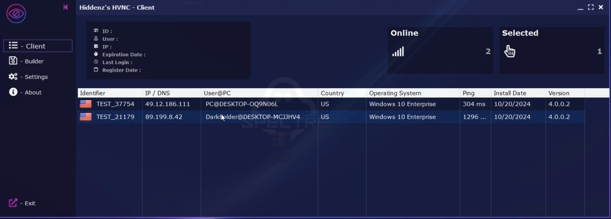

# Hvnc-Rat
t.me/spy_bx

## HVNC RAT which stands for “Hidden Virtual Network Computing” is a technology designed for covert remote control of computers. It is primarily used in system intrusion and complex network management, allowing users to access computers without the awareness of others. Unauthorized use of this technology is illegal and constitutes a violation of others’ personal rights. [▶️Click to read more - 點擊閱讀更多▶️](https://t.me/Spy_BX)

-------------------------------------
# [📥Download Link - 下载链接📥](t.me/spy_bx)
# [📥Download Link - 下载链接📥](t.me/spy_bx)

# [📥Download Link - 下载链接📥](t.me/spy_bx)
# [📥Download Link - 下载链接📥](t.me/spy_bx)
